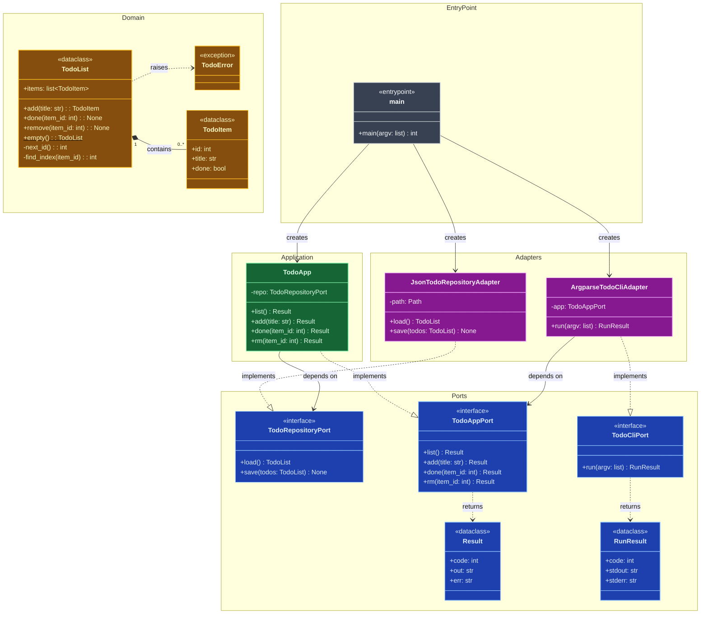

# Class diagram

```mermaid
classDiagram

  %% Definicje klas
  namespace Domain {
    class TodoError:::domain {
      <<exception>>
    }

    class TodoItem:::domain {
      <<dataclass>>
      +id: int
      +title: str
      +done: bool
    }

    class TodoList:::domain {
      <<dataclass>>
      +items: list~TodoItem~
      +add(title: str): TodoItem
      +done(item_id: int): None
      +remove(item_id: int): None
      +empty(): TodoList$
      -next_id(): int
      -find_index(item_id): int
    }
  }

  namespace Ports {
      class Result:::ports {
        <<dataclass>>
        +code: int
        +out: str
        +err: str
      }
      class RunResult:::ports {
          <<dataclass>>
          +code: int
          +stdout: str
          +stderr: str
      }
      class TodoRepositoryPort:::ports {
          <<interface>>
          +load() TodoList
          +save(todos: TodoList) None
      }
      class TodoAppPort:::ports {
          <<interface>>
          +list() Result
          +add(title: str) Result
          +done(item_id: int) Result
          +rm(item_id: int) Result
      }
      class TodoCliPort:::ports {
          <<interface>>
          +run(argv: list) RunResult
      }
  }

  namespace Adapters {
      class ArgparseTodoCliAdapter:::adapters {
          -app: TodoAppPort
          +run(argv: list) RunResult
      }
      class JsonTodoRepositoryAdapter:::adapters {
          -path: Path
          +load() TodoList
          +save(todos: TodoList) None
      }
  }

  namespace Application {
      class TodoApp:::app {
          -repo: TodoRepositoryPort
          +list() Result
          +add(title: str) Result
          +done(item_id: int) Result
          +rm(item_id: int) Result
      }
  }

  namespace EntryPoint {
      class main:::entry {
          <<entrypoint>>
          +main(argv: list) int
      }
  }

  classDef domain  fill:#854d0e,stroke:#fbbf24,color:#fef9c3
  classDef port    fill:#1e40af,stroke:#93c5fd,color:#dbeafe
  classDef app     fill:#166534,stroke:#86efac,color:#dcfce7
  classDef adapter fill:#86198f,stroke:#f0abfc,color:#fdf4ff
  classDef entry   fill:#374151,stroke:#d1d5db,color:#f9fafb

  %% --- Dziedziczenie i implementacje ---
  TodoApp ..|> TodoAppPort : implements
  ArgparseTodoCliAdapter ..|> TodoCliPort : implements
  JsonTodoRepositoryAdapter ..|> TodoRepositoryPort : implements

  %% --- Zależności (depends on) ---
  TodoApp --> TodoRepositoryPort : depends on
  ArgparseTodoCliAdapter --> TodoAppPort : depends on

  %% --- Kompozycja domenowa ---
  TodoList "1" *-- "0..*" TodoItem : contains
  TodoList ..> TodoError : raises

  %% --- Zwracane typy ---
  TodoAppPort ..> Result : returns
  TodoCliPort ..> RunResult : returns

  %% --- Composition root ---
  main --> JsonTodoRepositoryAdapter : creates
  main --> TodoApp : creates
  main --> ArgparseTodoCliAdapter : creates 
```
