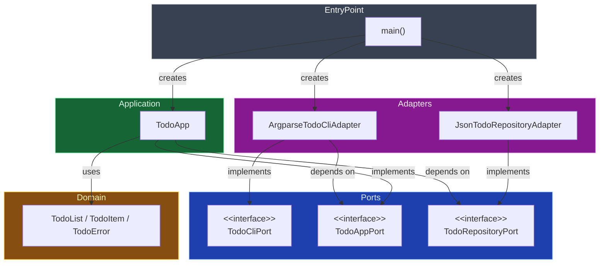

# Components

```mermaid
flowchart TB
    subgraph EntryPoint["EntryPoint"]
        main["main()"]
    end

    subgraph Adapters["Adapters"]
        CLI["ArgparseTodoCliAdapter"]
        REPO["JsonTodoRepositoryAdapter"]
    end

    subgraph Application["Application"]
        APP["TodoApp"]
    end

    subgraph Ports["Ports"]
        direction TB
        PORT_CLI["&lt;&lt;interface&gt;&gt<br>TodoCliPort"]
        PORT_APP["&lt;&lt;interface&gt;&gt<br>TodoAppPort"]
        PORT_REPO["&lt;&lt;interface&gt;&gt<br>TodoRepositoryPort"]
    end

    subgraph Domain["Domain"]
        DOMAIN["TodoList / TodoItem / TodoError"]
    end

    main -->|creates| CLI
    main -->|creates| APP
    main -->|creates| REPO

    CLI -->|implements| PORT_CLI
    CLI -->|depends on| PORT_APP

    APP -->|implements| PORT_APP
    APP -->|depends on| PORT_REPO
    APP -->|uses| DOMAIN

    REPO -->|implements| PORT_REPO

    style EntryPoint  fill:#374151,stroke:#d1d5db,color:#f9fafb
    style Adapters    fill:#86198f,stroke:#f0abfc,color:#fdf4ff
    style Application fill:#166534,stroke:#86efac,color:#dcfce7
    style Ports       fill:#1e40af,stroke:#93c5fd,color:#dbeafe
    style Domain      fill:#854d0e,stroke:#fbbf24,color:#fef9c3
```
